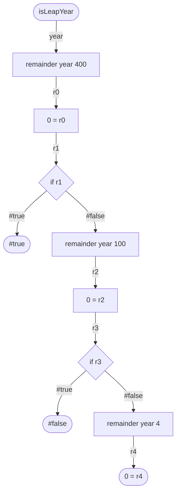
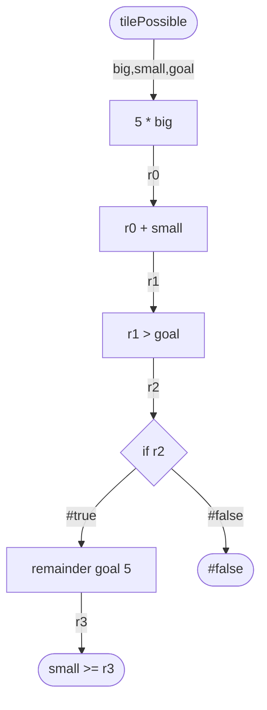
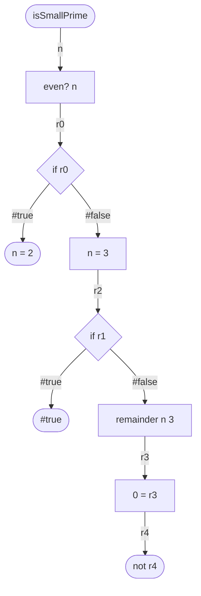

# Foundations of Computer Science Lab00

In this repository you will find this file and a file called _lab00-ifs.rkt_.
- README.md (the file you are currently reading) contains all the instructions for this assignment.
- lab00-ifs.rkt is the file that you will put all your answers in. It also contains some comments and code snippets that you should read through.

### Instructions
- For each question, you will be given a function description and a flowchart.
- Some of the nodes each flowchart have letters inside instead of functions. You will find corresponding letters in racket file as comments.
- In the racket file you will have to:
  1. Write what functions should go with the corresponding letter (this does not have to be in racket syntax).
  2. Translate the flow chart into a function in the space provided.
  3. Create test cases for each function that will test all possible paths of the flow chart. (only questions 0 and 1)

---
### Question 0:
Often, we think that all years that are multiples of 4 are leap years, but this is not exactly true.
- Years that are multiples of 100 but not 400 are not leap years.

The function `isLeapYear` should have a single parameter representing a year (positive integer greater than 0), and returns `#true` if the year is a leap year and `#false` otherwise.

---
### Question 1:
A tiling company has 5 inch and 1 inch tiles. They need to be able to figure out if they can make a row of tiles of a specific length with the amount of big (5 inch) and small (1 inch) tiles they have available.

The function `tilePossible` should have 3 parameters representing the number of big tiles available, the number of small tiles available, and the goal length. It should return `#true` if it is possible to make a row of the goal length with the given amount of tiles and `#false` otherwise.

---
### Question 2:
The function `isSmallPrime` should take in a number that is greater than 1 and less than 20 and return if that number is prime. You can assume that the input will always be valid. For reference, the prime numbers in that range are `2, 3, 7, 11, 13, 17, 19`.

